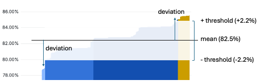

## Motivation

This tool sits between 2 existing tools:
- Ceph's built-in tool `ceph osd reweight-by-utilization` with questionable reweight decisions
- [TheJJ/ceph-balancer modifies upmap and can violate your CRUSH rules](https://github.com/TheJJ/ceph-balancer/issues/41)

`ceph osd reweight-by-utilization` can have bias for reducing weights of high-util OSDs, and not equally consider increasing low-util OSDs. 
This tool just addresses that deficiency.
It also analyses "up" not "current" util, so can re-run during a live rebalance. 
"up util" is a rough measure, assumes any PGs being actively remapped are 50% transferred.

## Install

Install Python dependencies: Pandas Numpy
> apt|dnf install python3-pandas python3-numpy

Then download and run script `reweight.py ... | tee rebalance.sh`

## Use

```
usage: reweight.py [-h] -p POOL [-m MIN] [-d OUTDIR] [-l LIMIT] [-o OSD] [-s]

Calculate Ceph OSD reweights using deviation from mean utilisation %. Only calculate - reweight is
still a manual task for you to review. Accounts for any PGs currently being remapped (ceph pg dump
pgs_brief), by analysing the utilisation after current remap completes.

options:
  -h, --help            show this help message and exit
  -p POOL, --pool POOL  Focus on this Ceph pool
  -m MIN, --min MIN     Deviation threshold. E.g. 5 means: ignore OSDs within mean util % +-5%
  -l LIMIT, --limit LIMIT
                        Optional: limit to N OSDs with biggest deviation
  -o OSD, --osd OSD     Optional: print detailed information for this OSD number
  -s, --cephadm         Run Ceph query commands via cephadm shell
```

## Example

Reweight OSDs with util deviation 2.2% from mean

> python3 ./reweight.py -p $pool -m 2.2 | tee rebalance.sh



```
# new_weights: count=15
     util current  util up   weight  new weight   shift  PGs up  PGs to move
id                                                                          
398        0.8540   0.8540  0.93924     0.91674 -0.0225      61         -1.5
20         0.8538   0.8538  0.95251     0.92991 -0.0226      60         -1.4
...
412        0.7863   0.7863  0.93964     0.97584  0.0362      55          2.1
483        0.7853   0.7853  0.95079     0.98769  0.0369      61          2.4
# PGs to write = 20 = 0.1%
```
